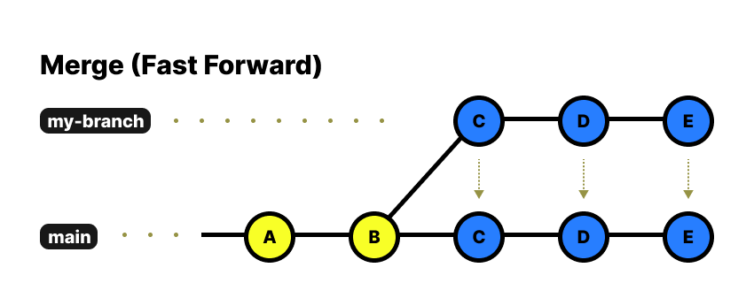
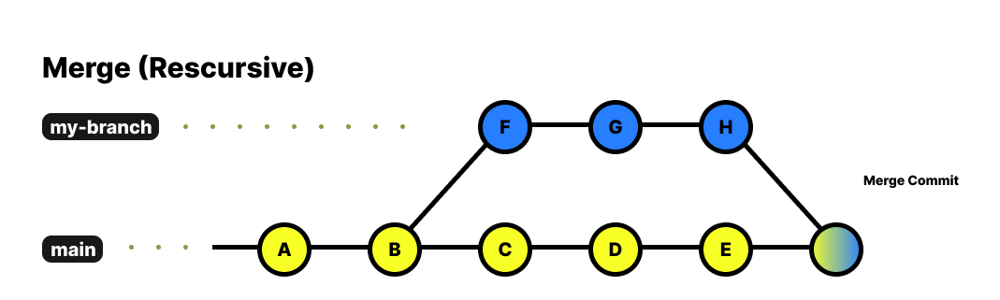
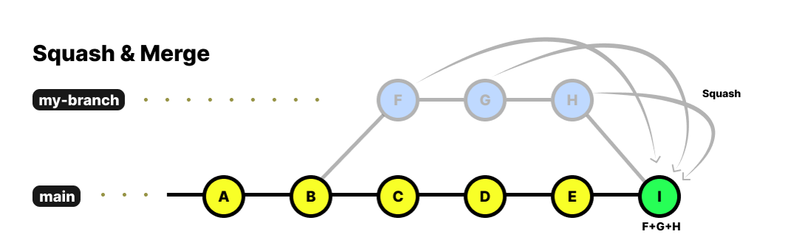
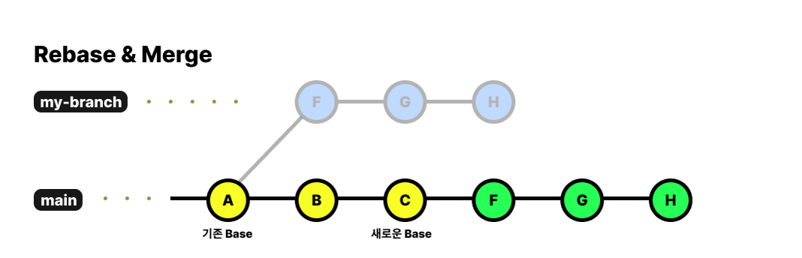

# CONTRIBUTING Guide 🛠️ 

이 저장소는 Java 백엔드 개발자 양성과정의 정리 및 팀 프로젝트 협업을 위한 공간입니다. <br>
개인 복습, 기능 구현, 팀 협업을 깔끔하게 관리하기 위해 아래와 같은 브랜치 전략과 작업 흐름을 따릅니다. <br> <br>

## 📚 목차

- [CONTRIBUTING Guide 🛠️](#contributing-guide-🛠️)

- [폴더 구조 및 브랜치 전략 📁](#폴더-구조-및-브랜치-전략-📁)

- [학습 및 정리 흐름 🧠](#학습-및-정리-흐름-🧠)

- [팀 프로젝트 협업 전략 🤝](#팀-프로젝트-협업-전략-🤝)

- [포크 업데이트 받기 🔄](#포크-업데이트-받기-🔄)

- [충돌 시 처리 ⚔️](#충돌-시-처리-⚔️)

- [커밋 스택 & 체크리스트 ✅](#커밋-스택--체크리스트-✅)

- [자주 쓰는 Git 명령어 정리 🧚](#자주-쓰는-git-명령어-정리-🧚)

  - [1. 변경 사항 / 상태 확인 🔍](#1-변경-사항--상태-확인-🔍)

  - [2. 브랜치 및 이력 관리 🌿](#2-브랜치-및-이력-관리-🌿)
  
  - [3. 커밋 관리 💾](#3-커밋-관리-💾)
  
  - [4. 브랜치 병합 전략 🔀](#4-브랜치-병합-전략-🔀)
  
  - [5. 작업 임시 저장 🧳](#5-작업-임시-저장-🧳)

## 폴더 구조 및 브랜치 전략 📁

| 폴더명               | 설명                 | 전용 브랜치         |
| ----------------- | ------------------ | -------------- |
| `note/`           | 수업 정리 및 요약         | `note-branch`  |
| `back/`           | 백엔드 기능 구현          | `back-branch`  |
| `front/`          | 프론트엔드 실습           | `front-branch` |
| `db/`             | DB 및 ERD 설계        | `db-branch`    |
| `my-reset-branch` | 공통 기본(사실상 main 역할) | -              |

<br>

## 학습 및 정리 흐름 🧠

### 1. **작업 브랜치로 이동**

```bash
git checkout note-branch  # 예: note 내용 정리 시

```

### 2. **커밋**

```bash
git add .
git commit -m "note: 07.14 스프링 MVC 패턴 정리"
git push origin note-branch
```

### 3. **병합이 필요할 경우**

```bash
git checkout my-reset-branch
git merge note-branch
```

<br>

## 팀 프로젝트 협업 전략 🤝

### 1. 브랜치 구조

* `main`: 실제 배포용
* `develop`: 통합 테스트용
* `feature/xxx`: 개별 기능 브랜치

### 2. 작업 순서

```bash
git checkout -b feature/이름-기능
# 작업
git add .
git commit -m "기능 설명"
git push origin feature/이름-기능
```

### 3. PR 시 기준

* `base`: 원본 저장소의 `develop`
* `compare`: 본인 포크의 `feature/작업명`

  <br>

## 포크 업데이트 받기 🔄

### 1. github 웹페이지 이용 방법

* Github > 포크 repo > "Sync Fork" 클릭

### 2. CLI 통한 업데이트

```bash
git remote add [포크 repo URL]   # 최초 1회만
git pull origin main
git push origin main
```

```bash
git remote add origin [원본 repo] # sync fork 없이 바로 fetch 및 pull 원할 때 추가
git fetch origin # origin(원본 저장소)의 변경 내용을 불러오기
git merge origin/main # origin(원본 저장소)의 변경 내용을 내 로컬 내용과 병합
```

<br>

## 충돌 시 처리 ⚔️

```bash
git stash                # 현재 작업 임시 저장
git pull origin develop
git stash pop            # 임시 저장한 내용 복원
```
<br>

## 커밋 스택 & 체크리스트 ✅

### 커밋 메시지 예시

```
note: 07.14 수업 내용 정리
back: login 기능 controller 수정
db: product 테이블 DDL 추가
```

### PR 체크리스트

* [ ] build 에러 없는가?
* [ ] 다른 파일에 영향을 준 작업이 없는가?
* [ ] 브랜치 기준이 정확한가? (`develop` base)

  <br>

## 🧎 PR 템플릿 (.github/PULL_REQUEST_TEMPLATE.md)

```md
### 작업 내용
- 무엇을 했는가?

### 체크리스트
- [ ] 빌드 성공?
- [ ] 충돌 없는가?
- [ ] 다른 파일에 영향 없는가?
```

<br>

## 자주 쓰는 Git 명령어 정리 🧚

### 1. 변경 사항 / 상태 확인 🔍
```bash
git status
git diff
git log --oneline
git reflog
```
<br>

✅ `git status` 

* 현재 작업 디렉토리 상태를 확인하는 기본 명령어
* 어떤 파일이 수정되었고, 어떤 파일이 스테이지(staged)에 올라갔는지 확인 가능

> ```bash
> git status
> ```

* 📌 Untracked, Modified, Staged 상태를 색상으로 구분해서 표시됨
* 🔧 커밋 전 꼭 실행해보는 습관 들이기

<br>

✅ `git diff`

* 작업 중인 파일의 변경사항을 확인
* 기본적으로는 Working Directory vs Staging Area 비교

> ```bash
> git diff                 # 워킹 디렉토리와 스테이징 영역 비교
> git diff --cached        # 스테이징 영역과 최신 커밋 비교
> git diff [브랜치1] [브랜치2]  # 브랜치 간 차이 확인
> ```

* 📌 커밋하기 전에 git diff와 --cached 둘 다 확인하면 실수 줄일 수 있음

<br>

✅ `git log --oneline`

* 커밋 이력을 한 줄 요약으로 확인 (최근 순)
> ```bash
> git log --oneline
> ```

* 🔍 간단한 커밋 내역 확인 또는 cherry-pick, reset 등에 사용

<br>

✅ `git reflog`

* HEAD가 어떤 경로로 이동했는지 로그를 남김
* reset, checkout, merge, commit 등 모든 HEAD 변경 기록 추적 가능
* 실수 복구용으로 필수 명령어
> ```bash
> git reflog
> ```

* 예시 출력:
> ```bash
> f3a3e1d HEAD@{0}: reset: moving to HEAD~1
> c0ffee1 HEAD@{1}: commit: 새로운 기능 추가
> ...
> ```

* 📌 실수로 reset 또는 rebase 해버렸을 때 되돌릴 수 있는 유일한 단서!

<br>

### 2. 브랜치 및 이력 관리 🌿
> ```bash
> git branch -a           # 로컬 + 원격 브랜치 전체 보기 (all)
> git checkout
> git switch
> git rm -r --cached
> ```
<br>

✅ `git branch -a`
* 로컬 및 원격 브랜치 전체 목록 확인
> ```bash
> git branch -a
> ```

* 📌 remotes/origin/브랜치명 → 원격 저장소의 브랜치

<br>

✅ `git checkout`
* 브랜치를 전환하거나 새 브랜치 생성
* 또는 특정 커밋/파일 복원에도 사용됨

> ```bash
> git checkout main             # 브랜치 전환
> git checkout -b dev            # 새 브랜치 생성 + 전환
> git checkout main -- index.jsp  # main 브랜치의 index.jsp 파일 가져오기
> ```

* 📌 최근 Git에서는 switch, restore 명령어로 분리됨

<br>

✅ `git switch`
- checkout보다 더 직관적인 브랜치 전환 전용 명령어

>```bash
> git switch 브랜치명                # 브랜치 전환
> git switch -c 새브랜치명           # 새 브랜치 생성 + 전환
> ```

* 🧠 참고: checkout은 강력하지만 실수하기 쉬움 <br>
→ switch는 안전하고 깔끔한 전환 전용 명령어

<br>

✅ `git rm -r --cached`
* Git이 추적 중인 파일/폴더를 stage에서 제거 (로컬 파일은 삭제 X)

```bash
git rm -r --cached node_modules
``` 

* 보통 .gitignore 설정 후 기존 추적 파일을 git에서 제거할 때 사용

* 📌 --cached를 붙이지 않으면 로컬에서도 파일 삭제됨

<br>

### 3. 커밋 관리 💾
``` bash
git commit -m
git commit --amend
git reset --hard HEAD~n
git cherry-pick
```
<br>

✅ `git commit -m`
* 파일 변경 내용을 로컬 저장소에 저장 (스냅샷 생성)

> ``` bash
> git add .
> git commit -m "fix: 로그인 시 비밀번호 체크 추가"
> ```

* 📌 커밋 메시지는 명확하고 일관되게 작성 <br>
  예: feat:, fix:, refactor:, docs: 등

<br>

✅ `git commit --amend`
> ```bash
> git commit --amend -m "fix: 로그인 유효성 체크 수정"
> ```
* 예시 사용 상황:
  - 오타 수정
  - 메시지 수정
  - 파일 추가 빠뜨린 경우

* 📌 이미 푸시된 커밋에 amend 후 다시 푸시할 땐 강제 푸시 필요
  > ```bash
  > git push --force
  > ```

<br>

✅ `git reset --hard HEAD~n`
* 현재 브랜치의 최근 n개 커밋을 완전히 되돌림
> ``` bash
> git reset --hard HEAD~1   # 마지막 커밋 1개 삭제
> git reset --hard HEAD~3   # 마지막 커밋 3개 삭제
> ```
* `--hard`: 커밋 기록, 스테이징 영역, 작업 디렉토리까지 모두 이전 상태로 되돌림

<br>

* 📛 주의: 되돌린 내용은 복구가 어려움 (백업 필수)
  - --soft: 커밋만 되돌리고, 작업 내용은 유지
  - --mixed (기본): 커밋과 스테이징 영역은 초기화, 작업 디렉토리는 유지

<br>

🌟 `git cherry-pick`
* 특정 커밋만 다른 브랜치에 복사해서 적용하고 싶을 때

> ```bash
> git checkout note-branch
> git cherry-pick abc1234     # 해당 커밋 ID
> ```

* 충돌 발생 시:
> ``` bash
> git status
> # 충돌 해결 후
> git add .
> git cherry-pick --continue # 충돌 수정 후 cherry-pick 계속 진행
> ```

* 중단하고 싶을 땐:
> ```bash
> git cherry-pick --abort # cherry-pick 취소 후 돌아가기
> ```

* 📌 실무에서 PR 하나에서 특정 커밋만 가져오고 싶을 때 매우 유용

<br>

### 4. 브랜치 병합 전략 🔀
```bash
git merge
git merge --squash
git rebase
```

✅ `git merge`
* 다른 브랜치의 내용을 현재 브랜치에 통합

* 기본 병합 방식은 상황에 따라 다름 <br>
→ Fast-Forward 또는 Recursive (Merge Commit 생성)

> ```bash
> git checkout develop
> git merge feature/login
>```

* 병합 완료 후 로그 확인
> ```bash
> git log --oneline --graph --all
>```

<br>

🔹 `Fast-Forward Merge`

* 병합 대상 브랜치가 직접적으로 최신 브랜치인 경우 <br>
→ 커밋 히스토리를 그대로 이어 붙임

> ```bash
> # develop이 수정되지 않았다면
> git checkout main
> git merge my-branch/main  # 커밋 그대로 붙음 (Merge Commit 없음)
> ```




* 새로운 브랜치 `my-branch`가 `main` 브랜치로부터 분기된 이후 `main` 브랜치에 새 커밋이 올라오지 않은 경우, `my-branch`가 `main`과 비교하여 최신 브랜치라고 할 수 있다.

* 이 경우 my-branch의 변경 이력을 그대로 `main`으로 가져올 수 있는데, 이를 **Fast-Forward Merge**라고 한다.

<br>

🔹 `Recursive Merge` (일반 Merge Commit)

* develop이나 main에 다른 커밋이 추가된 경우, Merge Commit 생성됨



* `my-branch`가 `main` 브랜치에서 분기되고 `main` 브랜치에 새 커밋이 생겼다면, `my-branch`는 최신으로 간주할 수 없다.

* 따라서 `main`과 `my-branch`는 공통 부모로 하나의 새로운 `Merge Commit`을 생성하게 되는데, 이를 **Recursive Merge**라고 한다.

<br>

✅ `git merge --squash`

* 여러 커밋을 하나로 압축(squash) 후 병합할 때 사용

* 히스토리를 깔끔하게 유지할 수 있음

> ```bash
> git checkout my-branch
> git merge --squash my-branch/main
> git commit -m "feat: 로그인 기능 통합"
> ```



* **Squash Merge는 병합할 브랜치의 모든 커밋을 압축하여 하나의 새로운 커밋을 Base 브랜치에 추가하는 방식의 병합을 의미한다.**

* Squash를 하게 되면 모든 커밋 이력이 하나의 커밋으로 합쳐지며 사라진다는 점을 주의해야 한다.

<br>

✅ `Rebase And Merge`

* 브랜치의 시작 지점을 다른 브랜치의 최신 커밋으로 변경

* 마치 기능 브랜치가 새로 시작한 것처럼 히스토리를 재작성

> ```bash
> git checkout my-branch
> git rebase TIL
> ```

* 병합 시 로그가 깔끔함 (Merge Commit 없음)

> ```bash
> git checkout TIL
> git merge my-branch
> ```

* 📌 주의: rebase 후에는 기존 커밋의 hash 값이 바뀌므로 force push 필요

> ```bash
> git push --force
> ```




Rebase를 알아보기 전에 Base가 무엇인지 알아보자. my-branch가 main 브랜치의 A 커밋에서 분기되었다고 하자. 이때, my-branch의 Base는 A 커밋이다.

그렇다면, Rebase는 무엇일까? 말 그대로 Base를 다시 설정한다는 의미이다. 그럼 Base를 어디로 다시 설정할까? my-branch가 분기된 main 브랜치의 최신 커밋이다.

<br>

| 전략               | 커밋 이력 유지 | Merge Commit 생성 | 히스토리 깔끔함 | 주의사항          |
| ---------------- | -------- | --------------- | -------- | ------------- |
| `merge`          | O        | O               | △        | 충돌 많아지면 지저분해짐 |
| `merge --squash` | X        | X (수동 커밋)       | O        | 개별 커밋 사라짐     |
| `rebase`         | O (수정됨)  | X               | ◎        | 커밋 hash 변경됨   |

<br>


### 5. 작업 임시 저장 🧳
```bash
git stash save "작업 내용 이름" # 작업 저장
git stash list                # 저장된 stash 목록
git stash show -p stash@{0}   # 특정 stash의 상세 내용 보기
git stash apply stash@{0}     # 특정 stash 적용 (삭제는 안됨)
git stash pop stash@{0}       # 적용 후 stash 삭제
git stash drop stash@{0}      # stash 삭제
```

✅ `git stash`

* 현재 작업 디렉토리의 변경사항을 임시 저장소에 저장하고 워킹 디렉토리를 초기화

> ```bash
> git stash
> ```

* 예시: 커밋 전인데 급히 다른 브랜치로 이동해야 할 경우

* 기본적으로 staged + unstaged 변경 모두 stash 가능

<br>

✅ `git stash save "메시지"`

* 저장할 때 메시지를 붙여서 나중에 식별 가능

> ``` bash
> git stash save "⚙️ 로그인 기능 중간 작업"
> ```

<br>

✅ `git stash list`

* stash 목록 확인

> ```bash
> git stash list
> ```

* 출력 예시:
> ```pgsql
> stash@{0}: On feature/login: ⚙️ 로그인 기능 중간 작업
> stash@{1}: WIP on develop: add auth interceptor
> ```

<br>

✅ `git stash show -p stash@{n}`

* 특정 stash의 변경 내역을 상세히 확인 (diff처럼)

> ```bash
> git stash show -p stash@{0}
> ```
 
 <br>

✅ `git stash apply`

* 지정한 stash를 적용 (stash는 그대로 남아 있음)

> ```bash
> git stash apply stash@{0}
> ```

<br>

✅ `git stash pop`

* 지정한 stash를 적용하고 목록에서도 제거

> ```bash
> git stash pop stash@{0}
> ```

* 🔥 충돌 가능성이 있는 경우 apply로 먼저 테스트하는 걸 추천

<br>

✅ `git stash drop`

* 지정한 stash를 삭제

> ```bash
> git stash drop stash@{0}
> ```

✅ `git stash clear`

* stash 전체 삭제 (⚠️ 주의)

> ```bash
> git stash clear
> ```

> 본 문서는 개인 학습 + 팀 협업을 위한 공통 가이드입니다. <br>
> 커밋, 브랜치, 충돌 처리 등은 이 문서를 기준으로 일관되게 유지합니다.

출처: [https://hudi.blog/git-merge-squash-rebase/](https://hudi.blog/git-merge-squash-rebase/)